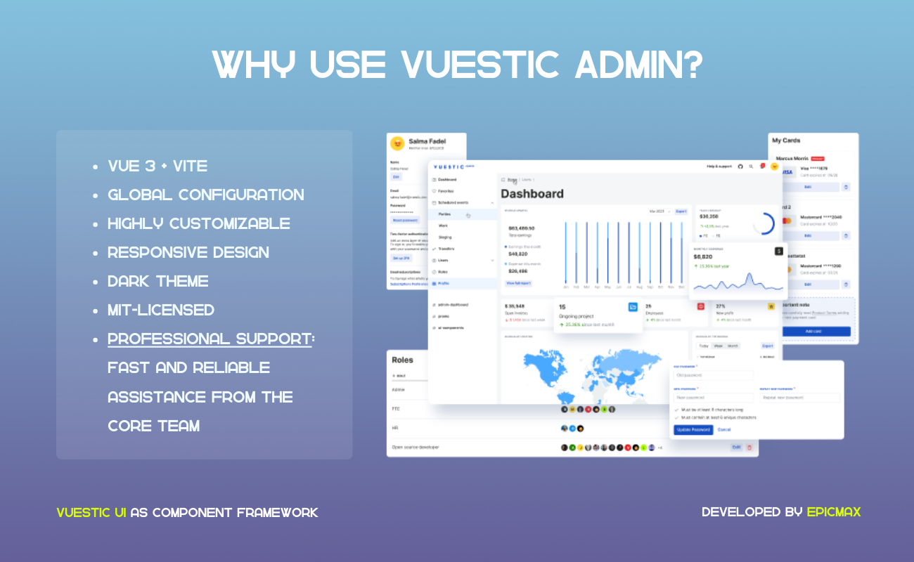
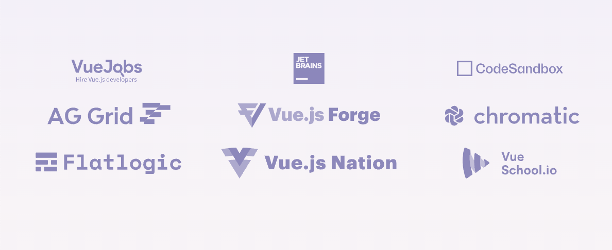

# Iotistic Admin

<p align="center">
  IoT-focused Admin Template for environmental monitoring and device management. Built with Vue 3, Vite, Pinia, and Tailwind CSS.
</p>

<p align="center">
  Developed for the Zemfyre Sensor project - a containerized IoT environmental monitoring system for Bosch BME688 sensors.
</p>

> Iotistic Admin is built with [Vuestic UI](https://ui.vuestic.dev) components for a professional admin interface experience.

<p align="center">
  <a href="https://admin.vuestic.dev" target="_blank">
    
  </a>
</p>

### Quick start

Install dependencies and start the development server:

```bash
npm install
npm run dev
```

The application will be available at `http://localhost:5173`

### Docker Deployment

Build and run with Docker:

```bash
# Build the image
docker build -t iotistic-admin:latest .

# Run the container
docker run -d -p 51850:80 --name iotistic-admin iotistic-admin:latest

# Or use Docker Compose
cd ..
docker-compose -f docker-compose.dev.yml up -d admin
```

See [DOCKER.md](./DOCKER.md) for complete Docker documentation.

### Documentation

- **Docker Setup:** [DOCKER.md](./DOCKER.md) - Complete Docker build and deployment guide
- **Rebranding:** [REBRANDING.md](./REBRANDING.md) - Iotistic branding changes
- **Application Manager:** [APPLICATION_MANAGER_INTEGRATION.md](./APPLICATION_MANAGER_INTEGRATION.md) - Backend integration
- **Main Project:** [../README.md](../README.md) - Full Zemfyre Sensor documentation
- **Vuestic UI:** [ui.vuestic.dev](https://ui.vuestic.dev) - Component documentation

### Features

- **Vue 3, Vite, Pinia, and Tailwind CSS -** Fast and efficient development
- **Dark Theme -** Modern and eye-catching
- **Global Configuration -** Effortless customization
- **Accessibility -** Inclusive and user-friendly
- **i18n Integration -** Easy localization for global reach
- **Educational Resource -** Ideal for learning and improving skills
- **Responsive Design -** Adapts seamlessly to all devices
- **Professional Support -** Reliable help from the experts
- **Highly Customizable -** Tailor to your project’s style

### Contributing

Thanks for all your wonderful PRs, issues and ideas.

<a href="https://github.com/epicmaxco/vuestic-admin/graphs/contributors">

</a>
<br>

You’re always welcome to join: check out
our <a href="https://ui.vuestic.dev/en/contribution/guide">
contribution guides</a>
, [open issues](https://github.com/epicmaxco/vuestic-ui/issues)
and [Discord server](https://discord.gg/jTKTjj2weV)

### Partners & Sponsors ❤️



Become a partner: [hello@epicmax.co](mailto:hello@epicmax.co)

### Can I hire you guys?

[Epicmax](https://epicmax.co) is committed to Open Source from its beginning. Vuestic Admin was created and backed by Epicmax, and is supported through all the years.

With 6+ years of dedicated work on both commercial and open-source projects, and more than 47 clients worldwide across various fields, Epicmax has deep expertise in frontend development, especially in Vue.js. We regularly conduct code audits for our projects and now excited to offer this service not only to our existing clients but to anyone looking to understand the state of their frontend code and ensure it's secure and up-to-date!

You can request a consultation or order web development services by Epicmax via this [form](https://epicmax.co/contacts) 😎

Say hi: <a href="mailto:hello@epicmax.co">hello@epicmax.co</a>. We will be happy to work with you!

[Other work](https://epicmax.co) we’ve done 🤘

[Meet the Team](https://ui.vuestic.dev/introduction/team)

### Awards

<a href="https://flatlogic.com/templates/vuestic-vue-free-admin" target="_blank">
    
</a>
<p>
  By <a href="https://flatlogic.com/templates/vuestic-vue-free-admin" target="_blank">@flatlogic</a> marketplace
</p>

### Premium Support and Consulting

Get Premium Support & Consulting services through our official development partner, Epicmax. As the main contributor to Vuestic UI and Vuestic Admin, Epicmax brings a wealth of expertise and experience to help you achieve your project goals efficiently and effectively.

[Get a quote](https://www.epicmax.co/?ref=vuestic-consulting)

### Follow us

Stay up to date with the latest Vuestic news! Follow us
on [Twitter](https://twitter.com/vuestic_ui)
or [Linkedin](https://www.linkedin.com/company/18509340)

### License

[MIT](https://github.com/epicmaxco/vuestic-admin/blob/master/LICENSE) license.
