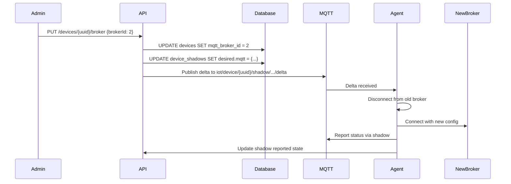

# How Devices Learn About Broker Changes

## The Problem

When you assign a device to a new broker:
```sql
UPDATE devices SET mqtt_broker_id = 2 WHERE uuid = 'device-123';
```

**The device doesn't automatically know!** It's still connected to the old broker.

## Solutions

### Solution 1: Device Shadow (Recommended) ✅

Use AWS IoT-style device shadow to notify the device of desired configuration changes.

#### Step 1: API Updates Shadow When Broker Changes

Create endpoint to update device broker:

**File:** `api/src/routes/devices.ts`

```typescript
/**
 * PUT /api/v1/devices/:uuid/broker
 * Assign device to a new MQTT broker
 */
router.put('/devices/:uuid/broker', async (req, res) => {
  try {
    const { uuid } = req.params;
    const { brokerId } = req.body;

    if (!brokerId) {
      return res.status(400).json({
        error: 'Missing broker ID',
        message: 'brokerId is required'
      });
    }

    // 1. Verify broker exists
    const brokerResult = await pool.query(
      'SELECT id, name, protocol, host, port FROM mqtt_broker_config WHERE id = $1',
      [brokerId]
    );

    if (brokerResult.rows.length === 0) {
      return res.status(404).json({
        error: 'Broker not found'
      });
    }

    const broker = brokerResult.rows[0];

    // 2. Update device broker assignment
    await pool.query(
      'UPDATE devices SET mqtt_broker_id = $1, updated_at = CURRENT_TIMESTAMP WHERE uuid = $2',
      [brokerId, uuid]
    );

    // 3. Update device shadow to notify device of new broker
    const shadowUpdate = {
      desired: {
        mqtt: {
          brokerId: broker.id,
          broker: `${broker.protocol}://${broker.host}:${broker.port}`,
          protocol: broker.protocol,
          host: broker.host,
          port: broker.port
        }
      }
    };

    await pool.query(
      `UPDATE device_shadows 
       SET desired = jsonb_set(
         COALESCE(desired, '{}'::jsonb),
         '{mqtt}',
         $1::jsonb
       ),
       version = version + 1,
       updated_at = CURRENT_TIMESTAMP
       WHERE device_uuid = $2`,
      [JSON.stringify(shadowUpdate.desired.mqtt), uuid]
    );

    // 4. Publish MQTT message to notify device immediately
    // (if MQTT manager is available)
    try {
      const mqttManager = require('../mqtt').getMqttManager();
      if (mqttManager) {
        await mqttManager.publish(
          `iot/device/${uuid}/shadow/name/device-state/update/delta`,
          JSON.stringify({
            state: {
              mqtt: shadowUpdate.desired.mqtt
            },
            version: shadowUpdate.version
          }),
          { qos: 1 }
        );
      }
    } catch (error) {
      console.warn('Could not publish shadow update via MQTT:', error);
    }

    res.json({
      success: true,
      message: `Device assigned to broker: ${broker.name}`,
      broker: {
        id: broker.id,
        name: broker.name,
        url: `${broker.protocol}://${broker.host}:${broker.port}`
      },
      shadowUpdated: true
    });
  } catch (error: any) {
    console.error('Error updating device broker:', error);
    res.status(500).json({
      error: 'Failed to update device broker',
      message: error.message
    });
  }
});
```

#### Step 2: Agent Watches Shadow for Broker Changes

**File:** `agent/src/shadow/shadow-feature.ts`

Add broker change handler:

```typescript
private handleDelta(delta: any): void {
  console.log('[Shadow] Received delta:', JSON.stringify(delta, null, 2));

  // Check if MQTT broker configuration changed
  if (delta.mqtt) {
    console.log('[Shadow] 🔄 Broker configuration changed!');
    console.log(`[Shadow] New broker: ${delta.mqtt.broker}`);
    
    // Notify supervisor to reconnect with new broker
    this.handleBrokerChange(delta.mqtt);
  }

  // Handle other delta changes...
}

private async handleBrokerChange(newBrokerConfig: any): Promise<void> {
  console.log('[Shadow] 📡 Initiating broker migration...');
  
  try {
    // 1. Report current state before disconnect
    await this.reportState({
      mqtt: {
        brokerId: newBrokerConfig.brokerId,
        status: 'migrating',
        previousBroker: this.mqttManager.getCurrentBroker()
      }
    });

    // 2. Disconnect from current broker gracefully
    console.log('[Shadow] Disconnecting from current broker...');
    await this.mqttManager.disconnect();

    // 3. Wait a bit for clean disconnect
    await new Promise(resolve => setTimeout(resolve, 2000));

    // 4. Reconnect with new broker configuration
    console.log(`[Shadow] Connecting to new broker: ${newBrokerConfig.broker}`);
    
    const connectOptions = {
      broker: newBrokerConfig.broker,
      protocol: newBrokerConfig.protocol,
      host: newBrokerConfig.host,
      port: newBrokerConfig.port,
      // ... other options from newBrokerConfig
    };

    await this.mqttManager.connect(connectOptions);

    // 5. Report successful migration
    await this.reportState({
      mqtt: {
        brokerId: newBrokerConfig.brokerId,
        broker: newBrokerConfig.broker,
        status: 'connected',
        migratedAt: new Date().toISOString()
      }
    });

    console.log('[Shadow] ✅ Broker migration completed successfully');

    // 6. Update shadow desired state (acknowledge)
    await this.updateDesiredState({
      mqtt: null  // Clear desired (already in reported)
    });

  } catch (error) {
    console.error('[Shadow] ❌ Broker migration failed:', error);
    
    // Report error state
    await this.reportState({
      mqtt: {
        status: 'error',
        error: (error as Error).message,
        failedAt: new Date().toISOString()
      }
    });
  }
}
```

### Solution 2: MQTT Command Topic 📡

Send command directly to device via MQTT.

**API publishes command:**
```typescript
// When broker changes
await mqttClient.publish(
  `iot/device/${uuid}/command/broker-change`,
  JSON.stringify({
    command: 'change-broker',
    brokerId: 2,
    broker: {
      protocol: 'mqtts',
      host: 'new-broker.example.com',
      port: 8883
    },
    timestamp: new Date().toISOString()
  }),
  { qos: 1, retain: false }
);
```

**Agent subscribes to command topic:**
```typescript
// In agent
this.mqttManager.subscribe(`iot/device/${deviceUuid}/command/broker-change`, (message) => {
  const command = JSON.parse(message.toString());
  
  if (command.command === 'change-broker') {
    console.log('Received broker change command:', command);
    this.handleBrokerMigration(command.broker);
  }
});
```

### Solution 3: Webhook/HTTP Callback 🌐

Device polls API for configuration changes.

**Agent polls periodically:**
```typescript
// In agent supervisor
setInterval(async () => {
  try {
    const response = await fetch(
      `${CLOUD_API_ENDPOINT}/api/v1/devices/${deviceUuid}/config`
    );
    const config = await response.json();
    
    if (config.mqtt.brokerId !== currentBrokerId) {
      console.log('Broker configuration changed, reconnecting...');
      await this.reconnectWithNewBroker(config.mqtt);
    }
  } catch (error) {
    console.error('Failed to fetch device config:', error);
  }
}, 60000);  // Poll every 60 seconds
```

### Solution 4: Job System 🎯

Use existing job system to send broker change job.

**API creates job:**
```typescript
await pool.query(`
  INSERT INTO device_jobs (
    device_uuid,
    job_type,
    job_data,
    status
  ) VALUES ($1, 'change-broker', $2, 'pending')
`, [
  uuid,
  JSON.stringify({
    brokerId: 2,
    broker: 'mqtts://new-broker.example.com:8883'
  })
]);
```

**Agent processes job:**
```typescript
// Agent already has job engine
case 'change-broker':
  await this.handleBrokerChange(job.job_data);
  break;
```

## Comparison

| Method | Pros | Cons | Real-time |
|--------|------|------|-----------|
| **Shadow** ✅ | Standard pattern, bidirectional, tracks state | Requires shadow implementation | Yes (MQTT) |
| **MQTT Command** | Simple, fast, direct | One-way, no state tracking | Yes (MQTT) |
| **HTTP Polling** | Works without MQTT, simple | Delayed, resource intensive | No (60s delay) |
| **Job System** | Uses existing infrastructure | More complex, requires job engine | Yes (if jobs use MQTT) |

## Recommended Implementation

**Use Device Shadow (Solution 1)** because:
1. ✅ Already implemented in your system
2. ✅ Bidirectional (device can report migration status)
3. ✅ State tracking (desired vs reported)
4. ✅ Persistent (survives disconnects)
5. ✅ Real-time notification via MQTT
6. ✅ Standard IoT pattern (AWS IoT compatible)

## Complete Flow



## Implementation Files

I'll create:
1. API endpoint for broker assignment
2. Agent broker change handler
3. Helper utilities
4. Documentation

Ready to implement?
